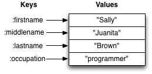

More Data Structures
===============

* Keywords and Maps
* Collections of Collections

## Keywords

```clj
:firstname  
:lastname
```

Keywords are the strangest of the basic value types, because they don't have a real world analog like numbers, strings, and booleans do. You can think of them as a special type of string, one that's used for labels. They are often used as keys for maps.


## Maps

Maps hold a set of keys and values associated with them. You can think of it like a dictionary: you look up things using a word (a keyword) and see the definition (its value). If you've programmed in another language, you might have seen something like maps--maybe called dictionaries, hashes, or associative arrays.



We write maps by enclosing alternating keys and values in curly braces, like so:

```clj
{:firstname "Sally" :lastname "Brown"}
{:a 1 :b "two"}
{}
```

Maps are useful because they can hold data in a way we normally think about it. Take our made up example, Sally Brown. A map can hold her first name and last name, her address, her favorite food, or anything else. It's a simple way to collect that data and make it easy to look up. The last example is an empty map. It is a map that is ready to hold some things, but doesn't have anything in it yet.

Let's look at some functions we can use with maps. We don't have nearly as many functions here in common as vectors and lists did.


```clj
(map? {:firstname "Sally" :lastname "Brown"})
;=> true

(get {:firstname "Sally" :lastname "Brown"} :firstname)
;=> "Sally"

(get {:firstname "Sally"} :lastname :MISS)
;=> :MISS
```

`map?` determines if the thing passed to it is a map and returns true or false

`get` works a lot like `nth` did with vectors, but takes a key instead of a number. It uses the supplied key to look up a value in the map. What do you think is happening with the second example of `get`? We can supply a value for `get` to return if it can't find the key we asked for. In this case, we supplied the key `:MISS`.

```clj
(assoc {:firstname "Sally"} :lastname "Brown")
;=> {:firstname "Sally", :lastname "Brown"}

(dissoc {:firstname "Sally" :lastname "Brown"} :lastname)
;=> {:firstname "Sally"}

(merge {:firstname "Sally"} {:lastname "Brown"})
;=> {:firstname "Sally" :lastname "Brown"}
```

`assoc` and `dissoc` are paired functions: they associate and disassociate items from a map. See how we add the last name "Brown" to the map with `assoc`, and then we remove it with `dissoc`. 

`merge` merges two maps together to make a new map.


```clj
(count {:firstname "Sally" :lastname "Brown"})
;=> 2
```

`count`, every collection has this function. Why do you think the answer is two? `count` is returning the number of associations.

```clj
(keys {:firstname "Sally" :lastname "Brown"})
;=> (:firstname :lastname)

(vals {:firstname "Sally" :lastname "Brown"})
;=> ("Sally" "Brown")
```

Then we have `keys` and `vals`, which are pretty simple: they return the keys and values in the map. The order is not guaranteed, so we could have gotten `(:firstname :lastname)` or `(:lastname :firstname)`.


Let's look at one more thing about maps before we move on. You can always use `get` to get values out of maps, but you'll more often see something like the following:

```clj
(:firstname {:firstname "Sally" :lastname "Brown"})
=> "Sally"
(:lastname {:firstname "Sally"})
=> nil
(:lastname {:firstname "Sally"} :MISS)
=> :MISS
```

You can use a keyword like you would use a function in order to look up values in a map. Feel free to use `get` in your own code: it can be more clear and less confusing as you're learning Clojure.

## Collections of Collections

Simple values such as numbers, keywords, and strings are not the only types of things you can put into collections. You can also put other collections into collections, so you can have a vector of maps, or a list of vectors, or whatever combination fits your data.

Vector of Maps

```clj
(def friends [{:firstname "Bob"}{:firstname "Jane"}])

(first friends)
=> {:firstname "Bob"}
```

Map of Maps

```clj
(def family {:brother {:firstname "Matt" :state "TX"}
             :sister1 {:firstname "Susan" :state "TN"}
             :sister2 {:firstname "Hannah" :state "IL"}})

(get family :brother)  => {:firstname "Matt" :state "TX"}
(:brother family)      => {:firstname "Matt" :state "TX"}

(get family :sister1)  => {:firstname "Susan" :state "TN"}
(:sister1 family)      => {:firstname "Susan" :state "TN"}
```


### EXERCISE 1: Modeling Yourself

Make a map representing yourself. Make sure it contains your first name and last name. Then, add your hometown to the map using [assoc](http://grimoire.arrdem.com/1.6.0/clojure.core/assoc/) or [merge](http://grimoire.arrdem.com/1.6.0/clojure.core/merge/).


### EXERCISE 2: Get the names of people

Create a function called `get-names` that takes a vector of maps of people and returns a vector of their names.

Here is an example of how it should work:

```clj
(get-names [{:firstname "Margaret" :lastname "Atwood"}
            {:firstname "Doris" :lastname "Lessing"}
            {:firstname "Ursula" :lastname "Le Guin"}
            {:firstname "Alice" :lastname "Munro"}])

;=> ["Margaret Atwood" "Doris Lessing" "Ursula Le Guin" "Alice Munro"]
```

Hint: First, create a function that returns the name when given a single person's map. Consider using the function [Map](http://grimoire.arrdem.com/1.6.0/clojure.core/map/) (covered on [Functions](functions.md) to apply that function to each element in your list of maps).


### EXERCISE 3: Modeling your classmates

First, take the map you made about yourself.

Then, create a vector of maps containing the first name, last name and hometown of two or three other classmates around you. 

Lastly, add your map to their information using [conj](http://grimoire.arrdem.com/1.6.0/clojure.core/conj/).

Use the `get-names` function from Exercise 2 to output a list of the names.
